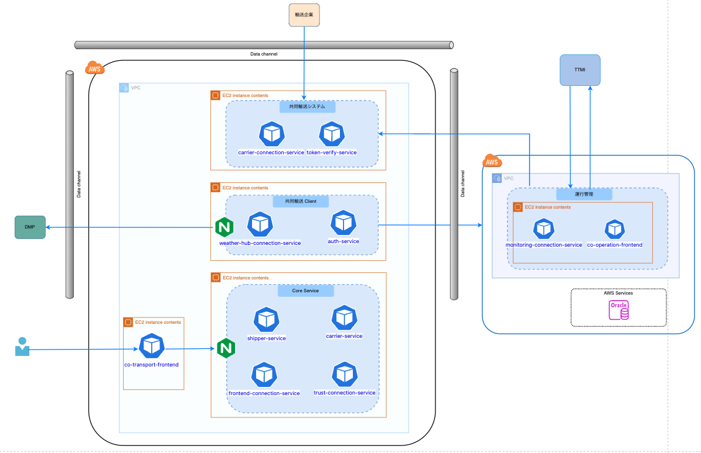

# 共同輸送システムプロジェクト - フロントエンド

## 概要・目的
このリポジトリは、共同輸送システムプロジェクトのフロントエンド部分を管理するものです。
以下、アーキテクチャ概要を示す。  


本システムは[co-transport-frontend](https://github.com/ODS-IS-CAVC/co-transport-frontend.git)です。

## 前提環境
- **Node.js:** v18 以上 v22 以下

## ビルド・起動手順
### 1. リポジトリのクローン
```bash
git clone https://github.com/ODS-IS-CAVC/co-transport-frontend.git
cd co-transport-frontend
```

### 2. パッケージのインストール
```bash
npm install
```

### 3. 環境変数の設定
`.env.local` ファイルを作成し、以下のように環境変数を設定します。

|環境変数                |説明 |例 |
|:-------------------------------------------|:-------|:-------|
|NEXT_PUBLIC_API_TRANSACTION                 |[frontend-connection-service](https://github.com/ODS-IS-CAVC/co-operation-backend-services.git/frontend-connection-service)のサービスのURL |http://localhost:2200 |
|NEXT_PUBLIC_API_CARRIER                 |[carrier-service](https://github.com/ODS-IS-CAVC/co-operation-backend-services.git/carrier-service)のサービスのURL |http://localhost:2900 |
|NEXT_PUBLIC_API_SHIPPER                 |[shipper-service](https://github.com/ODS-IS-CAVC/co-operation-backend-services.git/shipper-service)のサービスのURL |http://localhost:2100 |

### 4. 必要なAPI開発サーバーの起動
- frontend-connection-serviceサービスを起動する
- carrier-serviceサービスを起動する
- shipper-serviceサービスを起動する

### 5. 開発サーバーの起動
```bash
npm run dev 
```

## テスト手順
ブラウザで `http://localhost:3000` にアクセスして確認してください。

## 設計標準
### ユーザーインターフェース
  - 直感的な操作性を重視したUI設計
  - レスポンシブデザインによるマルチデバイス対応

### システム連携
  - RESTful APIとの通信
  - エラーハンドリング

### コンポーネント設計
- Atomic Designパターンの採用
  - atoms: 最小単位のUIパーツ
  - molecules: 複数のatomsの組み合わせ
  - organisms: 特定の機能を持つ複合コンポーネント
  - templates: ページレイアウト
  - pages: 実際のページコンポーネント

### ディレクトリ構成
```
/frontend
├── public/            # 静的ファイル
├── src/
│   ├── components/    # UIコンポーネント
│   ├── apps/          # Next.js のページルーティング
│   ├── constants/     # 共通で使用する定数を定義
│   ├── store/         # Redux Toolkit ストア
│   ├── hooks/         # カスタムフック
│   ├── utils/         # ユーティリティ関数
│   ├── lib/           # 共通ライブラリを定義 (dayjs、マッチング計算など)
│   ├── images/        # プロジェクトで使用する画像を格納 (ロゴ、トレーラー、トラクターなど)
│   ├── icons/         # SVG アイコンを格納 (https://fonts.google.com/icons にない場合)
│   ├── styles/        # Tailwind のスタイル設定
│   ├── messages/      # 共通テキストファイルを格納
│   ├── services/      # API サービスを格納
└── .env.local         # 環境変数（ローカル専用）
```

## 処理概要
### 荷主事業者の機能
- 配送依頼の登録・編集・削除
- 配送状況のリアルタイム追跡
- 配送履歴の管理

### 運送事業者の機能
- 車両情報の登録・編集・削除
- スケジュールの登録・編集・削除
- 配送可能時間帯の設定

### マッチング機能
- 荷主企業と運送事業者、運送事業者と運送事業者のマッチング
- マッチング結果の表示と通知
- マッチング履歴の管理

## コーディング規約
- **コーディングスタイル:** ESLint + Prettier を使用
- **コミットメッセージ:** `feat: 新機能追加`, `fix: バグ修正`, `docs: ドキュメント更新` など
- **ブランチ戦略:** `main`（本番）

## 問合せ・要望
問題が発生した場合や質問がある場合は、[サポートページ](https://github.com/ODS-IS-CAVC/co-transport-frontend/issues) にて Issue を作成してください。

## ライセンス
このプロジェクトは [MITライセンス](LICENSE.txt) のもとで公開されています。  
詳細についてはリポジトリ内の `LICENSE` ファイルをご確認ください

## 免責事項
- 本リポジトリの内容は予告なく変更・削除する可能性があります。
- 本リポジトリの利用により生じた損失及び損害等について、いかなる責任も負わないものとします。

## その他
プロジェクトへの貢献を歓迎します。貢献する前に、`CONTRIBUTING.md` を必ず確認してください。

